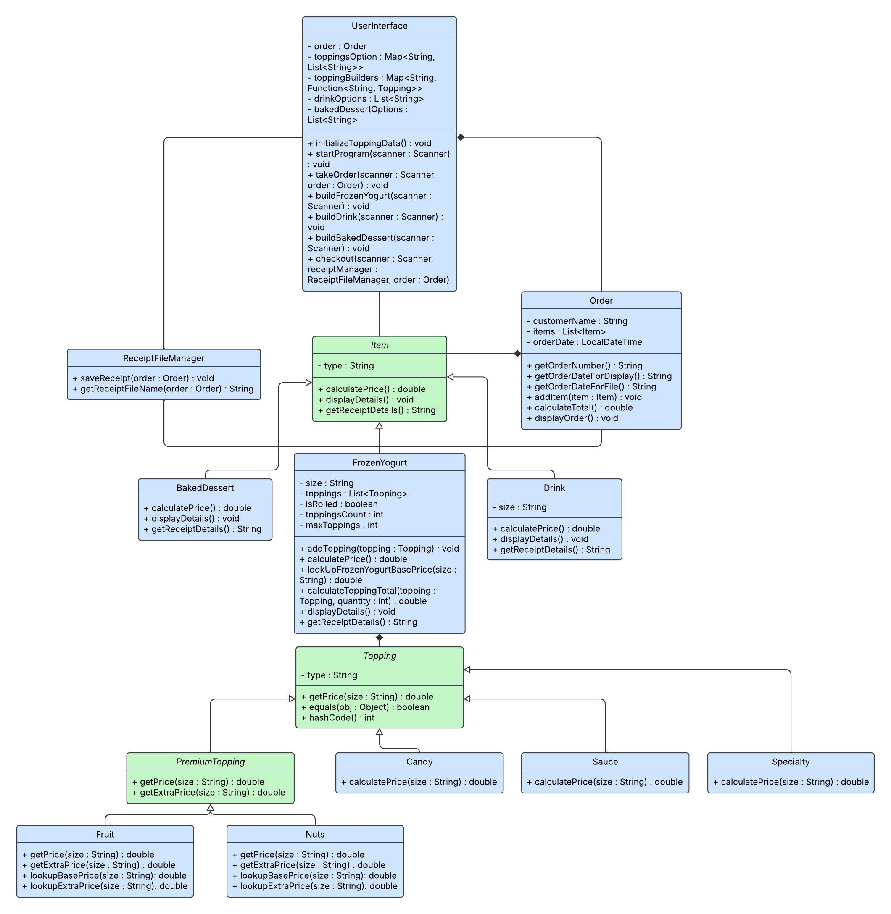
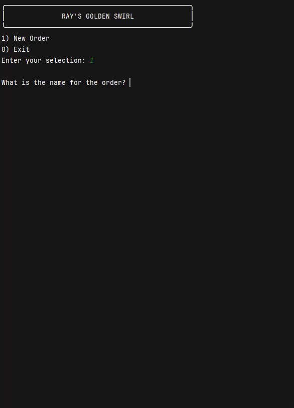

# Ray's Golden Swirl: POS Application

## Description 

Ray’s Golden Swirl is a Java-based command-line application that allows customers to build and customize dessert orders. 
Users can create frozen yogurt bowls, drinks, and baked desserts by selecting sizes, flavors, and toppings—including premium options and extras. 
The program supports adding multiple items, reviewing an order, and generating a formatted receipt file at checkout.

## UML Class Diagram

## User Stories

  
Click to expand

- As a shop owner, I want to store all available toppings, so that customers can select specific toppings and prices can be calculated consistently by size
- As a customer, I want to choose candy-style toppings, so that I can add sweetness and texture to my dessert
- As a customer, I want to add sauces, so that I can customize flavor without affecting texture
- As a customer, I want to add specialty toppings, so that I can experiment with unfamiliar condiments
- As a shop owner, I want to store all available premium toppings, so that customers can select specific premium toppings and prices can be calculated consistently by size
- As a customer, I want to add fresh fruit options, so that my dessert has healthier choices
- As a customer, I want to add nut-based toppings, so that I can enjoy premium crunchy options
- As a shop owner, I want to store all available items, so that customers can browse and select the items they want
- As a customer, I want to build a frozen yogurt with size and toppings, so that I can personalize my dessert
- As a customer, I want to order baked desserts, so that I can choose from non-frozen menu items
- As a customer, I want to order drinks to pair with desserts, so that my order feels complete
- As a customer, I want my order tracked with my list of items, so that my receipt is personalized and I can review my order
- As a customer, I want to view and edit my order contents, so that I can fix mistakes
- As a shop owner, I want the sum total of all items in an order, so that customer's final bill is accurate
- As a shop owner, I want each receipt stored in the receipts folder, so that sales records are retained
- As a shop owner, I want to open the main menu, so that customers can start placing orders
- As a customer, I want to see all available items, so that I can decide what to order
- As a customer, I want to interactively add items and toppings, so that I can build my order step by step
- As a customer, I want to confirm and complete my order, so that my transaction is finalized

## Setup

Instructions on how to set up and run the project using IntelliJ IDEA:

### Prerequisites

- IntelliJ IDEA: Ensure you have IntelliJ IDEA installed, which you can download from [here](https://www.jetbrains.com/idea/download/).
- Java SDK: Make sure Java SDK is installed and configured in IntelliJ.

### Running the Application in IntelliJ

Follow these steps to get your application running within IntelliJ IDEA:

1. Open IntelliJ IDEA.
2. Select "Open" and navigate to the directory where you cloned or downloaded the project.
3. After the project opens, wait for IntelliJ to index the files and set up the project.
4. Find the main class with the `public static void main(String[] args)` method.
5. Right-click on the file and select 'Run 'YourMainClassName.main()'' to start the application.

## Technologies Used

- Java: Amazon Corretto 17.0.16
- JUnit 5 (Jupiter)

## Demo

## Future Work

- Signature Items: introduce pre-defined templates for specialty FroYo items, which customers can select and customize. 
- Order Editing: modify or remove items before checkout. 
- Favorites System: save a customer’s favorite FroYo topping combination for quick re-ordering.

## Resources

- [Potato Sensei - OpenAI: ChatGpt 5 LLM](https://chatgpt.com/g/g-681d378b0c90819197b16e49abe384ec-potato-sensei)
- [Class Assert - JUnit](https://junit.org/junit4/javadoc/latest/org/junit/Assert.html)
- [Stream (Java Platform SE 8) - Oracle Documentation](https://docs.oracle.com/javase/8/docs/api/java/util/stream/Stream.html)
- [Java HashMap entrySet() - Retrieve Entry Set](https://docs.vultr.com/java/standard-library/java/util/HashMap/entrySet)
- [Java equals() and hashCode() Contracts](https://www.baeldung.com/java-equals-hashcode-contracts)

## Team Members

- **Natnael Tewolde:** Main Contributor

## Thanks

- Thank you to both *potato* senseis who were the inspiration behind this *potato* themed application!
